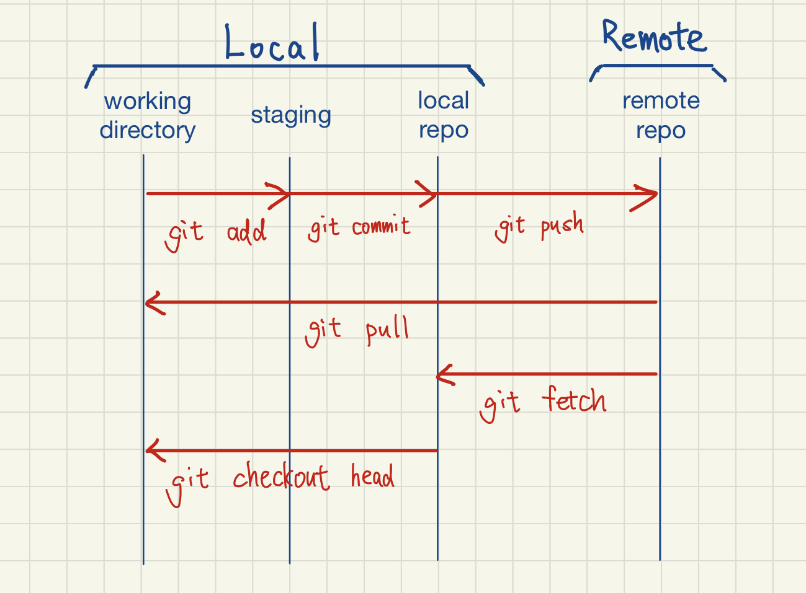
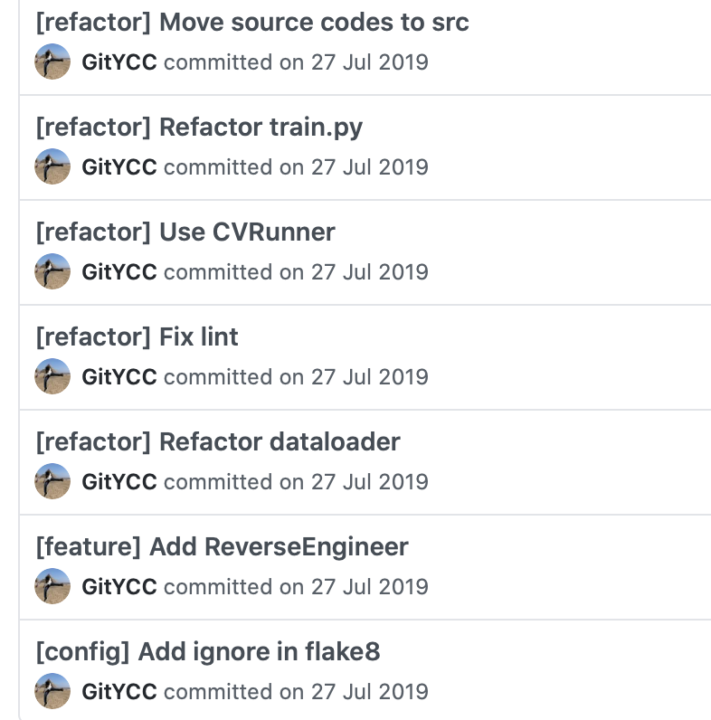
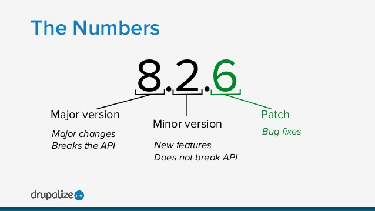
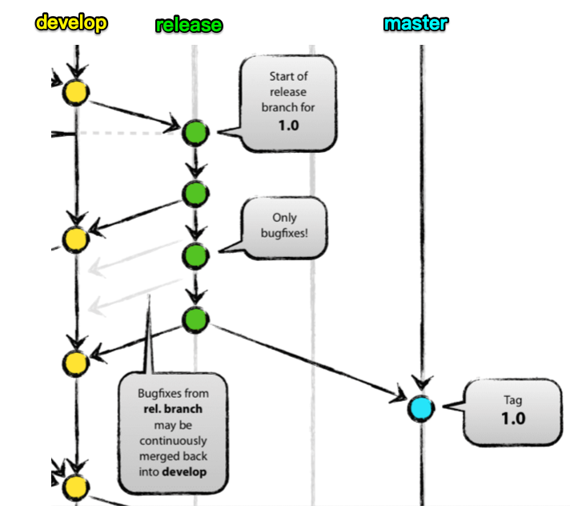
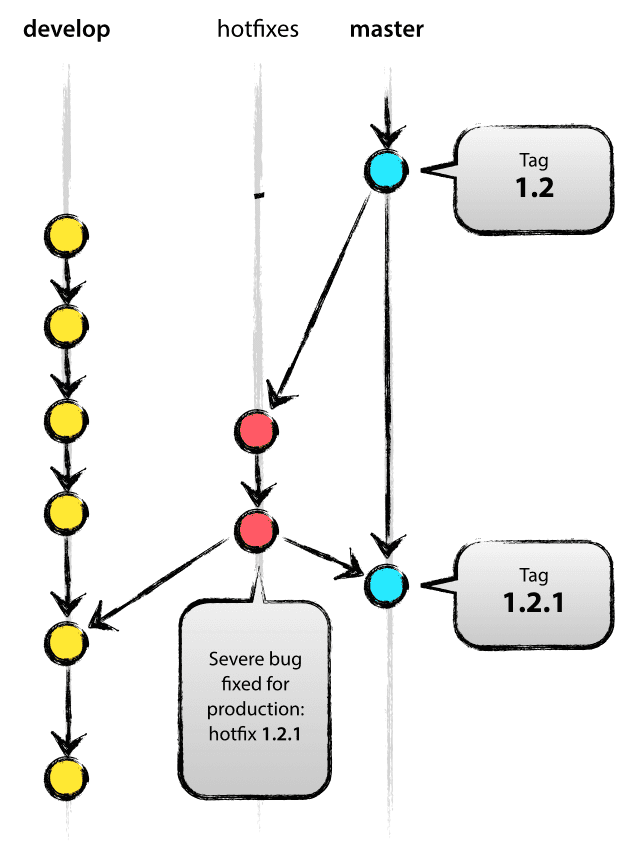
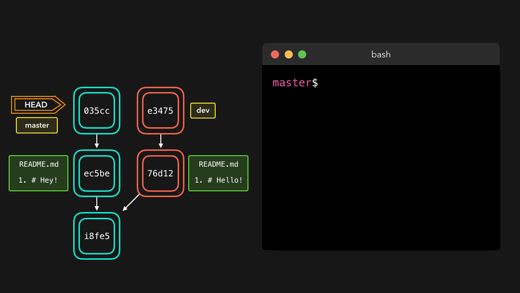

# Git Tutorial

## 1 Getting started

### 1-1 Local setting

```
$ git config --global user.name "YC Chen"
$ git config --global user.email ycc@example.com
```

### 1-2 Git aliases

```
$ git config --global alias.co checkout
$ git config --global alias.br branch
$ git config --global alias.ci commit
$ git config --global alias.st status
```

This means that, for example, instead of typing `git commit`, you just need to type `git ci`.

### 1-3 Getting a git repository

#### Initializing a repository in an existing directory

```
$ cd git-tutorial/
$ git init
$ git remote add origin https://github.com/xxx/git-tutorial.git
```

#### Cloning an existing repository

```
$ git clone https://github.com/GitYCC/git-tutorial.git
```


## 2 Workflow of Git

### 2-1 Introduction



### 2-2 Commands of workflow

Check status of workflow:

```
$ git status
```

Show the changes in *working directory* against *staging area*:

```
$ git diff
```

Show the changes in *staging area* against *local repo.*:

```
git diff --cached
```

Add one file from *working directory* to *staging area*:

```
$ git add my_file.py
```

Revert one file from *staging area* to *working directory*:

```
$ git reset my_file.py
```

Add a piece of code from *working directory* to *staging area*:

```
$ git add -N my_file.py  # if my_file.py is a new file, add untracked file without their content first
$ git add -p my_file.py
```

Commit:

```
$ git commit -m "[TAG] COMMIT MESSAGE"
```

### 2-3 Git ignore

A `.gitignore` file specifies intentionally untracked files that Git should ignore. Files already tracked by Git are not affected.

Templates of `.gitignore`: [https://github.com/github/gitignore](https://github.com/github/gitignore)

### 2-4 Exercise

- Create a new branch `feature/cat` from `develop`
- Create a file `cat.py` in `src/` including following codes

```python
class Cat:
    def __init__(self, name):
        self.name = name
    
    def get_name(self):
        return 'Cat ' + self.name
      
    def shout(self):
      	return 'Cat ' + self.name + ': meow~'
```

- Use `git status`, `git diff` and `git diff --cached` to check
- Add `src/cat.py` to *staging area*
- Use `git status`, `git diff` and `git diff --cached` to check
- Revert `src/cat.py` back to *working directory*
- Use `git status`, `git diff` and `git diff --cached` to check
- Commit function `__init__` and `get_name` with the message "[feature] Create cat"
- Commit function `shout` with the message "[feature] Add function shout"
- Use `git log --graph` to check history
- Checkout to the branch `develop` and merge `feature/cat` by `git merge feature/cat`
- Use `git log --graph` to check history


## 3 Commit

### 3-1 Best practice of commit

- Principle: One commit one action
- Format of commit message
  - `[feature] ...` :  create or change one feature
  - `[refactor] ...` :  change your code without changing any feature
  - `[config] ...` :  change config
  - `[fix] ...` :  fix bugs which are introduced from pervious feature
  - `[test] ...` :  create or change testing code
  - `[clean] ...` :  remove some useless code without changing any feature
  - `[doc] ...` :  create or change documentation

- Common mistakes of commit message

  - Commit messages are not readable.
  - Changing your codes without organization causes orderless commit messages.
  - Don't commit your codes after doing lots of actions (you should commit your codes after finishing one action)
    - If you need to commit codes after doing lots of actions, you could use `git add -p FILE`.
  - Don't commit lots of codes in one commit

- Examples:
  

### 3-2 Exercise

- Create a new branch `feature/zoo` from `develop`
- Create a file `main.py` in `src/` including following codes

```python
from dog import Dog
from cat import Cat

class Zoo:
    def __init__(self):
        self.animals = []
      
    def add(self, animal):
        self.animals.append(animal)

def main():
    zoo = Zoo()
    zoo.add(Cat('May'))
    zoo.add(Dog('Jacky'))

if __name__ == '__main__':
    main()

```

- Commit the file `main.py` with the message "[feature] Add animals into zoo"
- Extract the class `Zoo` to the single file `zoo.py`
- Commit above change with the message "[refactor] Extract class Zoo into single file"
- Add function `play` on `Zoo` as following:

```python
class Zoo:
    def __init__(self):
        self.animals = []

    def add(self, animal):
        self.animals.append(animal)
        
    def play(self):
      	for animal in self.animals:
            print(animal.shout())

```

- Commit above change with the message "[feature] Add function play on Zoo"
- Revise `main.py` as following:

```python
# ...

def main():
    zoo = Zoo()
    zoo.add(Cat('May'))
    zoo.add(Dog('Jacky'))
    zoo.play()

# ...
```

- Commit above change with the message "[feature] Play in zoo"
- Checkout to the branch `develop` and merge `feature/zoo` by `git merge feature/zoo`


## 4 Branch

### 4-1 All of branchs

- main branchs:
  - `master`
  - `develop`
- supporting branchs:
  - `feature/FEATURE-NAME`
  - `release/RELEASE-VERSION`
  - `hotfix/HOTFIX-NAME`

### 4-2 Main branchs

- `master`: production branch, usually connected with CICD to deploy
- `develop`: develop branch
- Main branchs must obey below rules:
  - Must not change the history of git => avoid to delete important codes
  - Must not change the codes directly on those branchs
  - Use PR (Pull Request) to change the codes on those branchs

### 4-3 Feature branch

- branch format: `feature/FEATURE-NAME`
- fork from `develop` and merge by PR
- rule: one feature, one thing, keep it simple


### 4-4 Release branch

- branch format: `release/RELEASE-VERSION`
- Release branch includes some changes for production 
- usually connected with CICD to trigger staging (fix bugs in release branch)
- Until fixing bugs on staging, merge into both `master` and `develop` with PR
- Tag version on `master` node
  - 



### 4-5 Hotfix branch

- branch format: `hotfix/HOTFIX-NAME`
- Find bugs after deploying production, fork hotfix branch from `master`
- After fixed the bugs, merge into both `master` and `develop` with PR




### 4-6 Commands of branch

- Create new branch and checkout: `git checkout -b BRANCH-NAME` 
- Checkout branch: `git checkout BRANCH`
- View branchs: `git branch`

- Merge: `git merge BRANCH` (seldom use, usually merge by PR)
  
  - fast-forward merge
    - 
  
  - no-fast-foward merge
    - 
  - merge conflicts
    - 
  
- Rebase: `git rebase BRANCH`

  - 

- Interactive Rebase: `git rebase -i NODE`

  - 
  - 

- Soft Reset: `git reset --soft NODE` 

  - 

- Hard Reset: `git reset --hard NODE`

  - 

- Cherry-pick: `git cherry-pick NODE` 

  - 

- Fetch: `git fetch origin BRANCH ` 

  - 

### 4-7 Exercise

- Checkout to branch `feature/dog-with-color`
- Rebase to `develop` (need to solve conflicts)
- Cherry-pick the commmit in the branch `feature/add-data`
- Try interactive rebase!


## Reference

- Git - Book: [https://git-scm.com/book/en/v2](https://git-scm.com/book/en/v2)
- git flow: https://nvie.com/posts/a-successful-git-branching-model/
- git flow (chinese): https://medium.com/kuma%E8%80%81%E5%B8%AB%E7%9A%84%E8%BB%9F%E9%AB%94%E5%B7%A5%E7%A8%8B%E6%95%99%E5%AE%A4/%E5%9F%BA%E7%A4%8E-git-flow-%E5%B7%A5%E4%BD%9C%E6%B3%95-fa50b1dddc4f
- 為你自己學Git: https://gitbook.tw
- visualized git commands: https://dev.to/lydiahallie/cs-visualized-useful-git-commands-37p1
- git cheatsheet: https://github.com/LeCoupa/awesome-cheatsheets/blob/master/tools/git.sh
- google code review: https://www.notion.so/Google-Code-Review-a275c5f3e017467a9b667e21c9521e39

